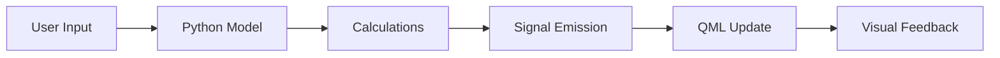

# Application Components Documentation

## Overview
This application provides various electrical engineering calculations and visualizations through a Qt/QML interface with Python backend.

## Core Components

### ThreePhase Module
The ThreePhaseSineWaveModel provides real-time simulation of three-phase electrical systems.

Key features:
- Interactive sine wave visualization
- Adjustable frequency, amplitude, and phase angles
- RMS and peak value calculations
- Line-to-line voltage calculations

```python
# Example usage:
model = ThreePhaseSineWaveModel()
model.setFrequency(50)  # Set to 50Hz
model.setAmplitudeA(325.27)  # 230V RMS * √2
```

### ElectricPy Module

#### ResonantFreq
Calculates resonant frequency for LC circuits:
- Input: Capacitance (μF) and Inductance (mH)
- Output: Resonant frequency in Hz
- Real-time updates

#### SeriesRLCChart
Interactive visualization of RLC circuit frequency response:
- Magnitude vs. frequency plot
- Automatic scaling
- Zoom and pan capabilities
- Resonance point highlighting

#### PhasorPlot
Real-time phasor diagram visualization:
- Adjustable magnitude and angle
- Interactive rotation
- Grid and reference circle
- Angle markers

### Python Models

#### PythonModel (Cable Calculator)
Handles cable calculations and data management:
- Voltage drop calculations
- Multiple cable types support
- CSV data import
- Batch calculations

Features:
- Dynamic table view
- Real-time updates
- Error checking
- Chart visualization

## Component Integration

### Signal Flow
1. User Interface (QML) → Input signals
2. Python backend → Calculations
3. Model updates → QML view updates

### Data Flow Example


## Application Structure

```
qmlTableView/
├── main.py              # Application entry point
├── models/              # Python backend models
│   ├── ElectricPy.py   # Electrical calculations
│   ├── ThreePhase.py   # Three-phase simulations
│   └── PythonModel.py  # Cable calculations
├── qml/                 # QML interface files
│   └── components/     
└── docs/               # Documentation
```

## Common Operations

### Adding a New Component
1. Create Python model class
2. Register type in main.py
3. Create QML interface
4. Connect signals and slots

```python
# Register new component
qmlRegisterType(NewComponent, "Module", 1, 0, "QMLName")
```

### Data Exchange
Models expose properties and methods to QML:
```python
@Property(float, notify=dataChanged)
def value(self):
    return self._value

@value.setter
def value(self, new_value):
    self._value = new_value
    self.dataChanged.emit()
```

## Best Practices

1. Signal Handling
   - Use proper typing for signals
   - Emit signals only when necessary
   - Handle edge cases

2. Performance
   - Minimize unnecessary updates
   - Use appropriate data structures
   - Batch operations when possible

3. Error Handling
   - Validate inputs
   - Provide meaningful error messages
   - Maintain stable state

## Common Issues and Solutions

### Issue: Slow Updates
Solution: 
- Use batch updates
- Implement data caching
- Optimize calculations

### Issue: Memory Leaks
Solution:
- Properly disconnect signals
- Clean up resources
- Use weak references

## Testing

### Unit Tests
- Test calculations
- Validate signal emissions
- Check edge cases

### Integration Tests
- Test QML-Python interaction
- Verify data flow
- Check component integration

## Contributing

1. Follow PEP 8 style guide
2. Document new features
3. Add unit tests
4. Update documentation

## Version History

- v1.0: Initial release
- v1.1: Added RLC simulation
- v1.2: Enhanced phasor plotting

# QML Components

## Three Phase Visualization

### WaveControls
Controls for adjusting wave parameters:
- Frequency (1-400 Hz)
- Amplitude (0-1000V) for each phase
- Phase angles (-360° to 360°)

### WaveChart
Real-time waveform visualization:
- Displays all three phases
- Time-based X-axis (0-1000ms)
- Voltage-based Y-axis (-400V to 400V)
- Color-coded phases (Red: A, Green: B, Blue: C)

### Measurements
Displays calculated values:
- RMS values for each phase
- Peak values for each phase
- Line-to-line RMS voltages
```
